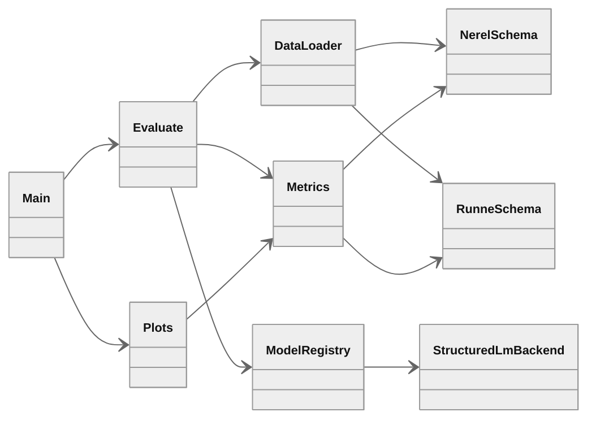

# IE SLM benchmark

End-to-end benchmark for structured information extraction from arbitrary Russian user text with small language models up to 2B parameters. Two Russian benchmarks are evaluated separately: [iluvvatar/NEREL](https://huggingface.co/datasets/iluvvatar/NEREL) and [iluvvatar/RuNNE](https://huggingface.co/datasets/iluvvatar/RuNNE). Each model receives raw text and must return a Pydantic-validated JSON object. Missing fields must remain empty. Per-benchmark CSV artefacts and PNG plots are stored under `results/`.

## Models

| Display name | Hugging Face registry id | Effective params | Structured output |
|---|---|---|---|
| `google/gemma-4-e2b` | `google/gemma-4-E2B-it` | 2.3B E2B | native JSON schema mode |
| `Qwen/Qwen3-1.7B` | `Qwen/Qwen3-1.7B` | 1.7B | `pydantic.BaseModel` via chat template |
| `olava-extract` | `IE_SLM_OLAVA_ID` default `numind/NuExtract-2.0-2B` | 2B MoE IE | template-driven JSON extraction |
| `tiny-pal` | `IE_SLM_TINY_PAL_ID` default `LiquidAI/LFM2-1.2B-Extract` | 1.2B Extract | template-driven JSON extraction |

Shared inference settings: `max_new_tokens=4096`, greedy decoding `do_sample=False`, temperature not used.

Override registry ids in `.env` before launch:

```bash
IE_SLM_OLAVA_ID=olava/olava-extract-2b-moe
IE_SLM_TINY_PAL_ID=tiny-pal/tiny-pal-2.8b-extract
```

## Architecture



## Repository layout

```
ie-slm-bench/
├── ie_slm_bench/
│   ├── config.py
│   ├── data.py
│   ├── parsers.py
│   ├── prompts.py
│   ├── metrics.py
│   ├── evaluate.py
│   ├── plots.py
│   └── models/
│       ├── registry.py
│       └── structured_lm.py
├── schemas/
│   ├── nerel.py
│   └── runne.py
├── scripts/
│   ├── install_colab.sh
│   ├── run_all.sh
│   ├── setup_gh_auth.py
│   └── push_results_github.py
├── .env.example
├── main.py
├── results/
│   ├── run/
│   │   ├── nerel/
│   │   └── runne/
│   └── assets/
└── requirements.txt
```

## Benchmarks

### NEREL

Source: [iluvvatar/NEREL](https://huggingface.co/datasets/iluvvatar/NEREL). Annotated Russian news documents with nested named entities, relations, and Wikidata links. Evaluation uses all annotated splits `train`, `test`, and `dev`: 933 documents in total. Original field names and label strings are preserved.

Pydantic schema: `schemas/nerel.py` with `entities`, `relations`, `links`. Entity types include `PERSON`, `ORGANIZATION`, `DATE`, `NATIONALITY`, and 25 further NEREL labels. Relation types include `WORKPLACE`, `HEADQUARTERED_IN`, `LOCATED_IN`, and 46 further NEREL labels.

Input example:

> Словацкий тренер Жолт Хорняк возглавил "Бананц" (Ереван)

Gold annotation example:

> `T1	NATIONALITY 0 9	Словацкий`
>
> `R1	WORKPLACE Arg1:T2 Arg2:T3`
>
> `N1	Reference T5 Wikidata:Q171336	`

Expected model output shape:

> `{"entities": [{"id": "T1", "type": "NATIONALITY", "start": 0, "end": 9, "text": "Словацкий"}], "relations": [{"id": "R1", "type": "WORKPLACE", "arg1": "T2", "arg2": "T3"}], "links": [{"id": "N1", "entity_id": "T5", "reference": "Wikidata:Q171336", "kb_name": null}]}`

### RuNNE

Source: [iluvvatar/RuNNE](https://huggingface.co/datasets/iluvvatar/RuNNE). Nested named entity recognition corpus derived from NEREL, used in the RuNNE-2022 shared task. Evaluation uses annotated splits `train` and `test`: 554 documents in total. The `dev` split is excluded because it has no entity annotations.

Pydantic schema: `schemas/runne.py` with `entities` only. Entity types are the original 29 RuNNE labels such as `PERSON`, `WORK_OF_ART`, `DATE`.

Input example:

> FakTyrA анонсировал сингл «Психопат» и назначил премьеру клипа

Gold annotation example:

> `0 7 PERSON`

Expected model output shape:

> `{"entities": [{"start": 0, "end": 7, "type": "PERSON"}]}`

## Sampling policy

For each benchmark independently:

- if $N \leq 5000$, use the full annotated dataset
- if $N > 5000$, subsample exactly $5000$ documents with fixed seed $s=42$

$$
\mathcal{I} = \mathrm{sort}\big(\mathrm{choice}(\{1,\ldots,N\},\,5000,\,\mathrm{seed}{=}42)\big)
$$

Current sizes: NEREL $N=933$, RuNNE $N=554$. Both benchmarks use all available annotated documents.

## Metrics

Let $y$ be the gold structure and $\hat{y}$ the model prediction after normalisation. Let $\mathcal{E}(\cdot)$ be the multiset of entity objects with exact span and label. Null values are $\varnothing$ for empty strings, `Wikidata:NULL`, and absent optional fields.

### 1. Strict Exact Match

Primary score. An example is correct iff the full normalised structure matches.

$$
\mathrm{SEM} = \frac{1}{|\mathcal{D}|}\sum_{(x,y)\in\mathcal{D}} \mathbf{1}\big[\mathrm{norm}(y) = \mathrm{norm}(\hat{y})\big]
$$

### 2. Field Precision, Recall, F1

Computed separately inside each benchmark for every original label value $l$ such as `entity:PERSON` or `relation:WORKPLACE`.

$$
P_l = \frac{|\mathcal{V}^{gold}_l \cap \mathcal{V}^{pred}_l|}{|\mathcal{V}^{pred}_l|}, \quad
R_l = \frac{|\mathcal{V}^{gold}_l \cap \mathcal{V}^{pred}_l|}{|\mathcal{V}^{gold}_l|}, \quad
F_l = \frac{2 P_l R_l}{P_l + R_l}
$$

Reported field scores are macro-averaged over labels present in either gold or prediction.

### 3. Null-field accuracy

For every nullable field $f$ where gold is empty:

$$
\mathrm{NFA} = \frac{1}{|\mathcal{F}_{null}|}\sum_{f\in\mathcal{F}_{null}} \mathbf{1}\big[\hat{y}_f = \varnothing\big]
$$

### 4. Hallucination rate

Fraction of nullable gold fields where the model invents a non-empty value:

$$
\mathrm{HR} = \frac{1}{|\mathcal{F}_{null}|}\sum_{f\in\mathcal{F}_{null}} \mathbf{1}\big[y_f = \varnothing \land \hat{y}_f \neq \varnothing\big]
$$

### 5. Schema validity rate

Fraction of raw model outputs that parse to JSON and pass Pydantic validation:

$$
\mathrm{SVR} = \frac{1}{|\mathcal{D}|}\sum_{(x,y)\in\mathcal{D}} \mathbf{1}\big[\hat{y} \models \mathrm{Schema}\big]
$$

### 6. Entity-level F1

Each nested entity is a separate object matched by exact $(start, end, type)$ for RuNNE and by $(id, type, start, end, text)$ for NEREL entities.

$$
P_{ent} = \frac{|\mathcal{E}(y)\cap\mathcal{E}(\hat{y})|}{|\mathcal{E}(\hat{y})|}, \quad
R_{ent} = \frac{|\mathcal{E}(y)\cap\mathcal{E}(\hat{y})|}{|\mathcal{E}(y)|}, \quad
F_{ent} = \frac{2P_{ent}R_{ent}}{P_{ent}+R_{ent}}
$$

## Google Colab workflow

Target hardware: NVIDIA L4 GPU. Models are loaded one at a time and released before the next model starts. Open a terminal in Colab and run the commands below.

### 1. Clone and install

```bash
git clone https://github.com/pymlex/ie-slm-bench.git
cd ie-slm-bench
bash scripts/install_colab.sh
```

`install_colab.sh` copies `.env.example` to `.env` when `.env` is missing, installs Python dependencies, and runs `gh auth login --web` when GitHub CLI is not authenticated. Browser login does not require `sudo`.

### 2. Secrets

Edit `.env` and set `HF_TOKEN`. Optional fields: `GITHUB_NAME`, `GITHUB_EMAIL`, `IE_SLM_GEMMA_ID`, `IE_SLM_QWEN3_ID`, `IE_SLM_OLAVA_ID`, `IE_SLM_TINY_PAL_ID`, `IE_SLM_RUN_DIR`.

```bash
cp .env.example .env
```

All entrypoints load variables from `.env` via `python-dotenv`.

### 3. Authenticate GitHub for result push

```bash
python scripts/setup_gh_auth.py
```

### 4. Run full benchmark

All four models on both benchmarks:

```bash
python main.py --all-models --run-dir results/run
```

Single model subset:

```bash
python main.py --models Qwen/Qwen3-1.7B --benchmarks nerel runne --run-dir results/run
```

NEREL only:

```bash
python main.py --all-models --benchmarks nerel --run-dir results/run
```

RuNNE only:

```bash
python main.py --all-models --benchmarks runne --run-dir results/run
```

Rebuild plots from existing CSV without inference:

```bash
python main.py --plots-only --run-dir results/run
```

### 5. Push results to GitHub

```bash
python scripts/push_results_github.py --message "Colab: IE SLM benchmark results"
```

`GITHUB_NAME` and `GITHUB_EMAIL` from `.env` are applied to the local git config before commit.

### Full pipeline

```bash
bash scripts/run_all.sh
```

Tracked artefacts:

- `results/run/nerel/gold.csv`
- `results/run/nerel/pred_<model>.csv`
- `results/run/nerel/metrics_example_<model>.csv`
- `results/run/nerel/metrics_label_<model>.csv`
- `results/run/nerel/metrics_summary_<model>.csv`
- the same five file families under `results/run/runne/`
- `results/assets/summary.csv`
- `results/assets/nerel_metrics.png`
- `results/assets/runne_metrics.png`
- `results/assets/nerel_field_f1_by_label.png`
- `results/assets/runne_field_f1_by_label.png`
- `results/metrics.json`

## Plot layout

Each benchmark has its own PNG file. Within one subplot at most four metric groups appear as clustered bars. One bar is one model. One group is one metric. NEREL and RuNNE are never mixed on the same axes.

## Benchmark results

Results appear after the Colab run and `scripts/push_results_github.py`. Summary table path: `results/assets/summary.csv`.

### NEREL

<p align="center">
  
</p>

### RuNNE

<p align="center">
  
</p>

## License

GPL-3.0. See [LICENSE](LICENSE).

## References

```bibtex
@misc{ie_slm_bench,
  author = {Alex Zyukov},
  title = {IE SLM Benchmark: Structured Information Extraction from Russian Text},
  year = {2026},
  publisher = {GitHub},
  howpublished = {\url{https://github.com/pymlex/ie-slm-bench}},
}
```

The project is under GPL-3.0 license.

```bibtex
@article{loukachevitch2021nerel,
  title={NEREL: A Russian Dataset with Nested Named Entities, Relations and Events},
  author={Loukachevitch, Natalia and Artemova, Ekaterina and Batura, Tatiana and Braslavski, Pavel and Denisov, Ilia and Ivanov, Vladimir and Manandhar, Suresh and Pugachev, Alexander and Tutubalina, Elena},
  journal={arXiv preprint arXiv:2108.13112},
  year={2021}
}
@article{Artemova2022runne,
  title={{RuNNE-2022 Shared Task: Recognizing Nested Named Entities}},
  author={Artemova, Ekaterina and Zmeev, Maksim and Loukachevitch, Natalia and Rozhkov, Igor and Batura, Tatiana and Braslavski, Pavel and Ivanov, Vladimir and Tutubalina, Elena},
  journal={Computational Linguistics and Intellectual Technologies: Proceedings of the International Conference Dialog},
  year={2022}
}
```
