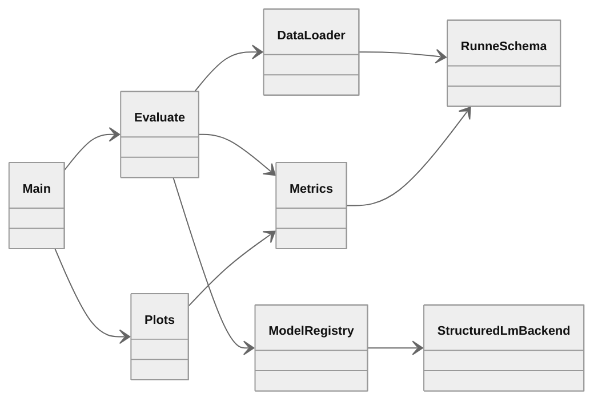

# IE SLM benchmark

End-to-end benchmark for structured information extraction from arbitrary Russian user text with small language models up to 2B parameters. The evaluation corpus is [iluvvatar/RuNNE](https://huggingface.co/datasets/iluvvatar/RuNNE). Each model receives raw text and must return a Pydantic-validated JSON object. Missing fields must remain empty. CSV artefacts and PNG plots are stored under `results/`.

## Models

| Display name | Hugging Face registry id | Effective params | Batch size default | Structured output |
|---|---|---|---|---|
| `Qwen/Qwen3-1.7B` | `Qwen/Qwen3-1.7B` | 1.7B | 16 | `pydantic.BaseModel` via chat template |
| `olava-extract` | `IE_SLM_OLAVA_ID` default `numind/NuExtract-2.0-2B` | 2B MoE IE | 12 | template-driven JSON extraction |
| `tiny-pal` | `IE_SLM_TINY_PAL_ID` default `LiquidAI/LFM2-1.2B-Extract` | 1.2B Extract | 24 | template-driven JSON extraction |

Shared inference settings: batched generation with left padding, `max_new_tokens=512`, bf16 on GPU by default, resume from partial `pred_*.csv`.

Doubling batch size above the default often increases VRAM without proportional speedup on L4 because generation becomes latency-bound. Keep `IE_SLM_BATCH_SIZE_QWEN3=16` unless profiling shows a gain.

Override registry ids in `.env` before launch:

```bash
IE_SLM_OLAVA_ID=olava/olava-extract-2b-moe
IE_SLM_TINY_PAL_ID=tiny-pal/tiny-pal-2.8b-extract
IE_SLM_BATCH_SIZE_QWEN3=16
```

## Architecture



## Repository layout

```
ie-slm-bench/
├── ie_slm_bench/
│   ├── config.py
│   ├── data.py
│   ├── parsers.py
│   ├── prompts.py
│   ├── metrics.py
│   ├── evaluate.py
│   ├── plots.py
│   └── models/
│       ├── registry.py
│       └── structured_lm.py
├── schemas/
│   └── runne.py
├── scripts/
│   ├── install_colab.sh
│   ├── run_all.sh
│   ├── setup_gh_auth.py
│   └── push_results_github.py
├── .env.example
├── main.py
├── results/
│   ├── run/
│   └── assets/
└── requirements.txt
```

## Benchmark

### RuNNE

Source: [iluvvatar/RuNNE](https://huggingface.co/datasets/iluvvatar/RuNNE). Nested named entity recognition corpus for Russian news-style text, used in the RuNNE-2022 shared task. Evaluation uses annotated splits `train` and `test`: 554 documents in total. The `dev` split is excluded because it has no entity annotations. Original entity type labels are preserved.

Pydantic schema: `schemas/runne.py` with field `entities`. Entity types are the original 29 RuNNE labels such as `PERSON`, `WORK_OF_ART`, `DATE`.

Input example:

> FakTyrA анонсировал сингл «Психопат» и назначил премьеру клипа

Gold annotation example:

> `0 7 PERSON`

Expected model output shape:

> `{"entities": [{"start": 0, "end": 7, "type": "PERSON"}]}`

## Sampling policy

- if $N \leq 5000$, use the full annotated dataset
- if $N > 5000$, subsample exactly $5000$ documents with fixed seed $s=42$

$$
\mathcal{I} = \mathrm{sort}\big(\mathrm{choice}(\{1,\ldots,N\},\,5000,\,\mathrm{seed}{=}42)\big)
$$

Current size: RuNNE $N=554$. The full annotated dataset is used.

## Metrics

Let $y$ be the gold structure and $\hat{y}$ the model prediction after normalisation. Let $\mathcal{E}(\cdot)$ be the multiset of entity objects with exact span and label $(start, end, type)$. Nested entities are separate objects.

### 1. Strict Exact Match

Primary score. An example is correct iff the full normalised structure matches.

$$
\mathrm{SEM} = \frac{1}{|\mathcal{D}|}\sum_{(x,y)\in\mathcal{D}} \mathbf{1}\big[\mathrm{norm}(y) = \mathrm{norm}(\hat{y})\big]
$$

### 2. Field Precision, Recall, F1

Computed for every original label value $l$ such as `entity:PERSON`.

$$
P_l = \frac{|\mathcal{V}^{gold}_l \cap \mathcal{V}^{pred}_l|}{|\mathcal{V}^{pred}_l|}, \quad
R_l = \frac{|\mathcal{V}^{gold}_l \cap \mathcal{V}^{pred}_l|}{|\mathcal{V}^{gold}_l|}, \quad
F_l = \frac{2 P_l R_l}{P_l + R_l}
$$

Reported field scores are macro-averaged over labels present in either gold or prediction.

### 3. Null-field accuracy

For documents where gold contains no entities, the model must also return an empty `entities` list.

$$
\mathrm{NFA} = \frac{1}{|\mathcal{F}_{null}|}\sum_{f\in\mathcal{F}_{null}} \mathbf{1}\big[\hat{y}_f = \varnothing\big]
$$

### 4. Hallucination rate

Fraction of entity-empty gold documents where the model returns at least one entity.

$$
\mathrm{HR} = \frac{1}{|\mathcal{F}_{null}|}\sum_{f\in\mathcal{F}_{null}} \mathbf{1}\big[y_f = \varnothing \land \hat{y}_f \neq \varnothing\big]
$$

### 5. Schema validity rate

Fraction of raw model outputs that parse to JSON and pass Pydantic validation:

$$
\mathrm{SVR} = \frac{1}{|\mathcal{D}|}\sum_{(x,y)\in\mathcal{D}} \mathbf{1}\big[\hat{y} \models \mathrm{Schema}\big]
$$

### 6. Entity-level F1

Each entity is matched by exact $(start, end, type)$.

$$
P_{ent} = \frac{|\mathcal{E}(y)\cap\mathcal{E}(\hat{y})|}{|\mathcal{E}(\hat{y})|}, \quad
R_{ent} = \frac{|\mathcal{E}(y)\cap\mathcal{E}(\hat{y})|}{|\mathcal{E}(y)|}, \quad
F_{ent} = \frac{2P_{ent}R_{ent}}{P_{ent}+R_{ent}}
$$

## Google Colab workflow

Target hardware: NVIDIA L4 GPU. Models are loaded one at a time and released before the next model starts. Open a terminal in Colab and run the commands below.

### 1. Clone and install

```bash
git clone https://github.com/pymlex/ie-slm-bench.git
cd ie-slm-bench
bash scripts/install_colab.sh
```

`install_colab.sh` copies `.env.example` to `.env` when `.env` is missing, installs Python dependencies, and runs `gh auth login --web` when GitHub CLI is not authenticated. Browser login does not require `sudo`.

### 2. Secrets

Edit `.env` and set `HF_TOKEN`. Optional fields: `GITHUB_NAME`, `GITHUB_EMAIL`, `IE_SLM_QWEN3_ID`, `IE_SLM_OLAVA_ID`, `IE_SLM_TINY_PAL_ID`, `IE_SLM_RUN_DIR`, `IE_SLM_MAX_NEW_TOKENS`, `IE_SLM_MAX_INPUT_CHARS`, `IE_SLM_MAX_INPUT_TOKENS`, `IE_SLM_LOAD_IN_4BIT`, `IE_SLM_SAVE_EVERY_N`, `IE_SLM_BATCH_SIZE_QWEN3`, `IE_SLM_BATCH_SIZE_OLAVA`, `IE_SLM_BATCH_SIZE_TINY_PAL`.

```bash
cp .env.example .env
```

All entrypoints load variables from `.env` via `python-dotenv`.

### 3. Authenticate GitHub for result push

```bash
python scripts/setup_gh_auth.py
```

### 4. Run full benchmark

All three models:

```bash
python main.py --all-models --run-dir results/run
```

Single model:

```bash
python main.py --models Qwen/Qwen3-1.7B --run-dir results/run
```

Rebuild plots from existing CSV without inference:

```bash
python main.py --plots-only --run-dir results/run
```

### 5. Push results to GitHub

```bash
python scripts/push_results_github.py --message "Colab: IE SLM benchmark results"
```

`GITHUB_NAME` and `GITHUB_EMAIL` from `.env` are applied to the local git config before commit.

Interrupted runs resume automatically from `results/run/pred_<model>.csv`.

### Full pipeline

```bash
bash scripts/run_all.sh
```

Tracked artefacts:

- `results/run/gold.csv`
- `results/run/pred_<model>.csv`
- `results/run/metrics_example_<model>.csv`
- `results/run/metrics_label_<model>.csv`
- `results/run/metrics_summary_<model>.csv`
- `results/assets/summary.csv`
- `results/assets/runne_metrics.png`
- `results/assets/runne_field_f1_by_label.png`
- `results/metrics.json`

## Plot layout

Within one subplot at most four metric groups appear as clustered bars. One bar is one model. One group is one metric.

## Benchmark results

Results appear after the Colab run and `scripts/push_results_github.py`. Summary table path: `results/assets/summary.csv`.

<p align="center">
  
</p>

## License

GPL-3.0. See [LICENSE](LICENSE).

## References

```bibtex
@misc{ie_slm_bench,
  author = {Alex Zyukov},
  title = {IE SLM Benchmark: Structured Information Extraction from Russian Text},
  year = {2026},
  publisher = {GitHub},
  howpublished = {\url{https://github.com/pymlex/ie-slm-bench}},
}
```

The project is under GPL-3.0 license.

```bibtex
@article{Artemova2022runne,
  title={{RuNNE-2022 Shared Task: Recognizing Nested Named Entities}},
  author={Artemova, Ekaterina and Zmeev, Maksim and Loukachevitch, Natalia and Rozhkov, Igor and Batura, Tatiana and Braslavski, Pavel and Ivanov, Vladimir and Tutubalina, Elena},
  journal={Computational Linguistics and Intellectual Technologies: Proceedings of the International Conference Dialog},
  year={2022}
}
```
