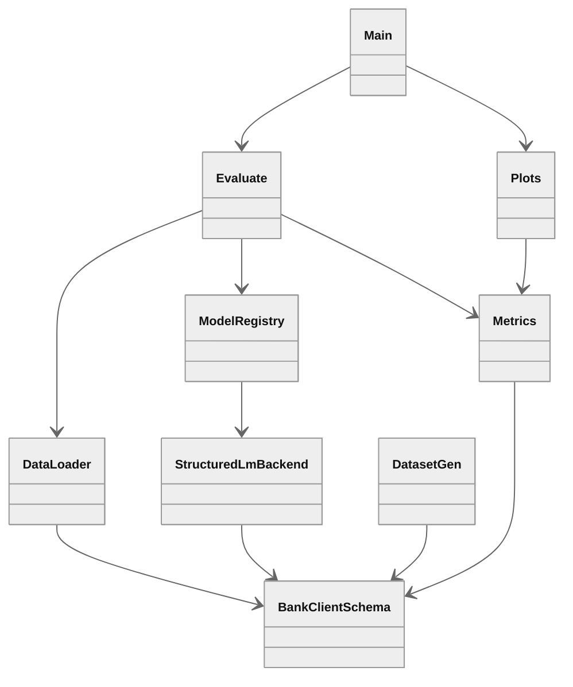
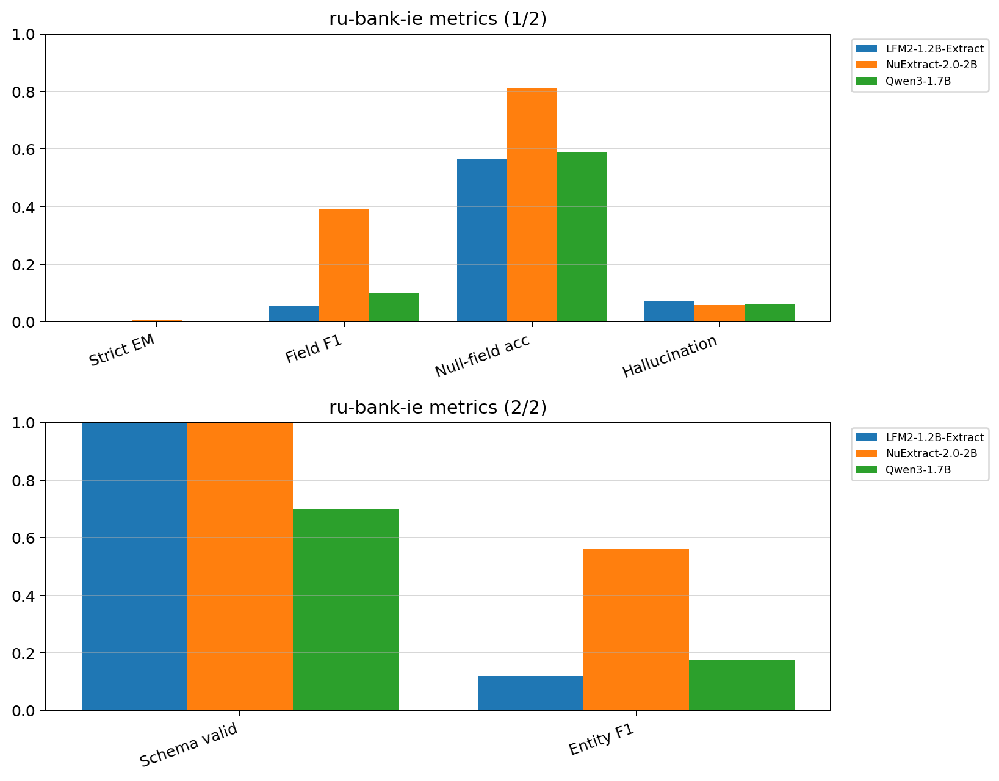

# IE SLM benchmark

End-to-end benchmark for structured information extraction from Russian bank client text with small language models up to 2B parameters. The evaluation corpus is [pymlex/ru-bank-ie](https://huggingface.co/datasets/pymlex/ru-bank-ie). Each model receives raw client text and must return a Pydantic-validated JSON object via Outlines constrained decoding. Missing fields must remain `null`. Evaluation metrics are published separately at [pymlex/ru-bank-ie-lm-eval](https://huggingface.co/datasets/pymlex/ru-bank-ie-lm-eval).

## Models

| Display name | Hugging Face registry id | Effective params | Batch size default | Structured output |
|---|---|---|---|---|
| `Qwen/Qwen3-1.7B` | `Qwen/Qwen3-1.7B` | 1.7B | 16 | `BankClientExtraction` via Outlines |
| `olava-extract` | `IE_SLM_OLAVA_ID` default `numind/NuExtract-2.0-2B` | 2B VL IE | 12 | NuExtract template + `BankClientExtraction` |
| `tiny-pal` | `IE_SLM_TINY_PAL_ID` default `LiquidAI/LFM2-1.2B-Extract` | 1.2B Extract | 24 | `BankClientExtraction` via Outlines |

Dataset generator: `Qwen/Qwen3.5-4B` via `IE_SLM_GENERATOR_MODEL`.

Shared inference settings: batched generation with left padding, `max_new_tokens=1536`, bf16 on GPU by default, resume from partial `pred_*.csv`.

## Architecture



## Repository layout

```
ie-slm-bench/
├── ie_slm_bench/
│   ├── config.py
│   ├── data.py
│   ├── parsers.py
│   ├── prompts.py
│   ├── metrics.py
│   ├── evaluate.py
│   ├── plots.py
│   └── models/
│       ├── registry.py
│       └── structured_lm.py
├── schemas/
│   └── bank_client.py
├── dataset_gen/
│   ├── masks.py
│   ├── llm.py
│   └── generate.py
├── scripts/
│   ├── install_colab.sh
│   ├── install_ubuntu_jupyter.sh
│   ├── generate_dataset.sh
│   ├── run_all.sh
│   ├── push_dataset_hf.py
│   ├── push_lm_eval_hf.py
│   ├── setup_gh_auth.py
│   └── push_results_github.py
├── .env.example
├── main.py
├── results/
│   ├── run/
│   └── assets/
└── requirements.txt
```

## Benchmark

### ru-bank-ie

Source: [pymlex/ru-bank-ie](https://huggingface.co/datasets/pymlex/ru-bank-ie). Synthetic Russian bank client messages paired with gold JSON annotations. The evaluation split contains coverage-valid pairs only. Current size $N=368$.

Pydantic schema: `schemas/bank_client.py` with fixed Russian field aliases. Nested types: `Address`, `WorkExperience`.

| Field alias | Type |
|---|---|
| Фамилия, Имя, Отчество | `str \| null` |
| Дата рождения, Год рождения, Место рождения | `str/int \| null` |
| Гражданство, Пол | `str \| null` |
| Серия и номер паспорта, Кем выдан паспорт, Дата выдачи, Код подразделения | `str \| null` |
| ИНН | `str \| null` |
| СНИЛС | `str \| null` |
| Адрес регистрации, Адрес фактического проживания | `Address \| null` |
| Номер мобильного телефона, Адрес электронной почты | `str \| null` |
| Место работы, Должность на работе | `str \| null` |
| Стаж работы | `{лет, месяцев} \| null` |
| Ежемесячный доход | `int \| null` |
| Семейное положение | `str \| null` |
| Количество иждивенцев, Наличие кредитов/займов | `int \| null` |
| Наличие недвижимости, Наличие автомобиля | `str \| null` |

Input example:

> Здравствуйте, меня зовут Артемьев Иван Сергеевич. ИНН 7707083893, телефон +7 916 123-45-67.

Gold annotation example:

```json
{"Фамилия": "Артемьев", "Имя": "Иван", "Отчество": "Сергеевич", "ИНН": "7707083893", "Номер мобильного телефона": "+79161234567"}
```

## Dataset generation

Generation runs on Colab with `Qwen/Qwen3.5-4B` and Outlines.

1. **Stage 1** — batched Outlines generation of 500 independent `BankClientExtraction` JSON objects. Each sample draws a random keep ratio in $[0.2, 0.8]$ over all fields. Batching is for throughput only: prompts differ by diversity key, region, job, batch slot and used surnames.
2. **Stage 2** — batched generation of chat-style client messages from each gold JSON. Model output is split into `reasoning` and `text`.
3. **Stage 3** — batched Qwen coverage check on `text` only, stored in `validation_json`. `test.jsonl` keeps rows with `all_present=true` and non-empty `text`.

```bash
bash scripts/generate_dataset.sh --n 500 --out-dir data/ru-bank-ie
bash scripts/finalize_and_push_dataset.sh --data-dir data/ru-bank-ie
```

## Sampling policy

- if $N \leq 5000$, use the full dataset
- if $N > 5000$, subsample exactly $5000$ documents with fixed seed $s=42$

$$
\mathcal{I} = \mathrm{sort}\big(\mathrm{choice}(\{1,\ldots,N\},\,5000,\,\mathrm{seed}{=}42)\big)
$$

Current size: ru-bank-ie $N=368$ coverage-valid pairs from 500 generated stage-3 rows.

## Metrics

Let $y$ be the gold structure and $\hat{y}$ the model prediction after normalisation. Let $\mathcal{F}(\cdot)$ be the flattened map from JSON path to string value. Let $\mathcal{V}^{gold}_l$ and $\mathcal{V}^{pred}_l$ be multisets of values for field label $l$.

### 1. Strict Exact Match

$$
\mathrm{SEM} = \frac{1}{|\mathcal{D}|}\sum_{(x,y)\in\mathcal{D}} \mathbf{1}\big[\mathcal{F}(y) = \mathcal{F}(\hat{y})\big]
$$

### 2. Field Precision, Recall, F1

$$
P_l = \frac{|\mathcal{V}^{gold}_l \cap \mathcal{V}^{pred}_l|}{|\mathcal{V}^{pred}_l|}, \quad
R_l = \frac{|\mathcal{V}^{gold}_l \cap \mathcal{V}^{pred}_l|}{|\mathcal{V}^{gold}_l|}, \quad
F_l = \frac{2 P_l R_l}{P_l + R_l}
$$

Reported field scores are macro-averaged over labels present in either gold or prediction.

### 3. Null-field accuracy

For each flattened field $f$:

$$
\mathrm{NFA} = \frac{1}{|\mathrm{keys}|}\sum_{f} \mathbf{1}\big[\mathcal{F}(y)_f = \varnothing \Leftrightarrow \mathcal{F}(\hat{y})_f = \varnothing\big]
$$

### 4. Hallucination rate

Fraction of gold-null fields where the model predicts a non-null value:

$$
\mathrm{HR} = \frac{1}{|\mathrm{keys}|}\sum_{f} \mathbf{1}\big[\mathcal{F}(y)_f = \varnothing \land \mathcal{F}(\hat{y})_f \neq \varnothing\big]
$$

### 5. Schema validity rate

$$
\mathrm{SVR} = \frac{1}{|\mathcal{D}|}\sum_{(x,y)\in\mathcal{D}} \mathbf{1}\big[\hat{y} \models \mathrm{BankClientExtraction}\big]
$$

### 6. Entity-level F1

Each non-null $(\mathrm{path}, \mathrm{value})$ pair is one entity.

$$
P_{ent} = \frac{|\mathcal{E}(y)\cap\mathcal{E}(\hat{y})|}{|\mathcal{E}(\hat{y})|}, \quad
R_{ent} = \frac{|\mathcal{E}(y)\cap\mathcal{E}(\hat{y})|}{|\mathcal{E}(y)|}, \quad
F_{ent} = \frac{2P_{ent}R_{ent}}{P_{ent}+R_{ent}}
$$

## Google Colab workflow

Target hardware: NVIDIA L4 or RTX GPU. Models are loaded one at a time and released before the next model starts.

### Ubuntu Jupyter

```bash
git clone https://github.com/pymlex/ie-slm-bench.git
cd ie-slm-bench
bash scripts/install_ubuntu_jupyter.sh
cp .env.example .env
bash scripts/generate_dataset.sh
python scripts/push_dataset_hf.py
```

Outlines structured generation requires `build-essential` for Triton kernels, or `TORCHDYNAMO_DISABLE=1` which is set by default in install scripts.

### 1. Clone and install

```bash
git clone https://github.com/pymlex/ie-slm-bench.git
cd ie-slm-bench
bash scripts/install_colab.sh
```

### 2. Secrets

Edit `.env` and set `HF_TOKEN`. Optional fields: `GITHUB_NAME`, `GITHUB_EMAIL`, `IE_SLM_GENERATOR_MODEL`, `IE_SLM_DATASET_REPO`, `IE_SLM_LM_EVAL_REPO`, `IE_SLM_DATA_DIR`, `IE_SLM_DATASET_SIZE`, `IE_SLM_GEN_BATCH_SIZE`, `IE_SLM_QWEN3_ID`, `IE_SLM_OLAVA_ID`, `IE_SLM_TINY_PAL_ID`, `IE_SLM_RUN_DIR`, `IE_SLM_MAX_NEW_TOKENS`, `IE_SLM_BATCH_SIZE_QWEN3`, `IE_SLM_BATCH_SIZE_OLAVA`, `IE_SLM_BATCH_SIZE_TINY_PAL`.

```bash
cp .env.example .env
```

### 3. Generate dataset and push to Hugging Face

```bash
bash scripts/generate_dataset.sh
python scripts/push_dataset_hf.py
```

### 4. Run benchmark

```bash
python main.py --all-models --run-dir results/run
```

### 5. Push metrics to Hugging Face and GitHub

```bash
python scripts/push_lm_eval_hf.py --run-dir results/run
python scripts/push_results_github.py --message "Colab: IE SLM benchmark results"
```

Interrupted runs resume automatically from `results/run/pred_<model>.csv`.

### Full pipeline

```bash
bash scripts/run_all.sh
```

Tracked artefacts:

- `results/run/gold.csv`
- `results/run/pred_<model>.csv`
- `results/run/metrics_example_<model>.csv`
- `results/run/metrics_label_<model>.csv`
- `results/run/metrics_summary_<model>.csv`
- `results/assets/summary.csv`
- `results/assets/ru_bank_ie_metrics.png`
- `results/assets/ru_bank_ie_field_f1_by_label.png`
- `results/metrics.json`

## Plot layout

Within one subplot at most four metric groups appear as clustered bars. One bar is one model. One group is one metric.

## Benchmark results

Results appear after the Colab run and `scripts/push_results_github.py`. Summary table path: `results/assets/summary.csv`.

<p align="center">
  
</p>

## License

GPL-3.0. See [LICENSE](LICENSE).

## References

```bibtex
@misc{ie_slm_bench,
  author = {Zyukov, Alexey},
  title = {IE SLM Benchmark: Structured Information Extraction from Russian Bank Client Text},
  year = {2026},
  publisher = {GitHub},
  howpublished = {\url{https://github.com/pymlex/ie-slm-bench}},
}
```

```bibtex
@misc{zyukov2026ru_bank_ie,
  title={ru-bank-ie: Russian Bank Client Information Extraction Benchmark},
  author={Zyukov, Alexey},
  year={2026},
  howpublished={\url{https://huggingface.co/datasets/pymlex/ru-bank-ie}}
}
```

The project is under GPL-3.0 license.
